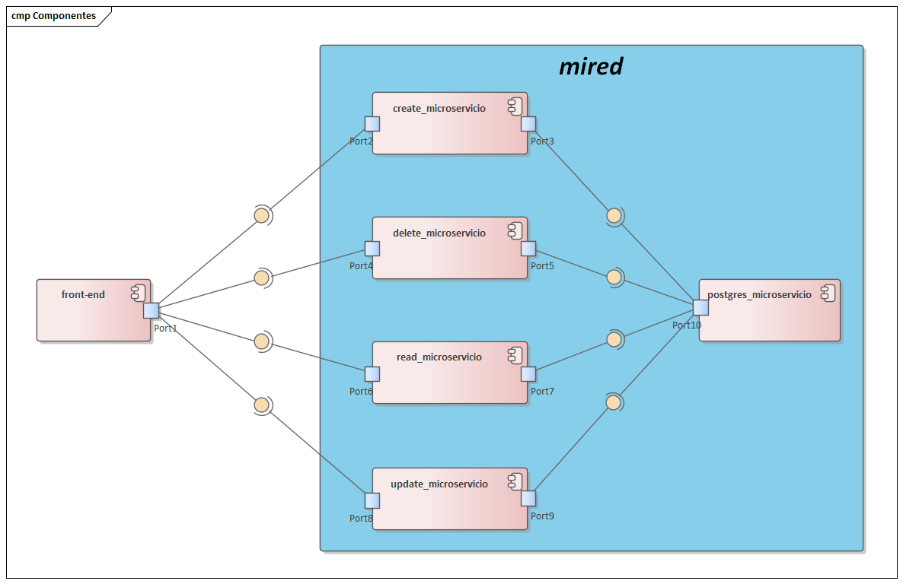
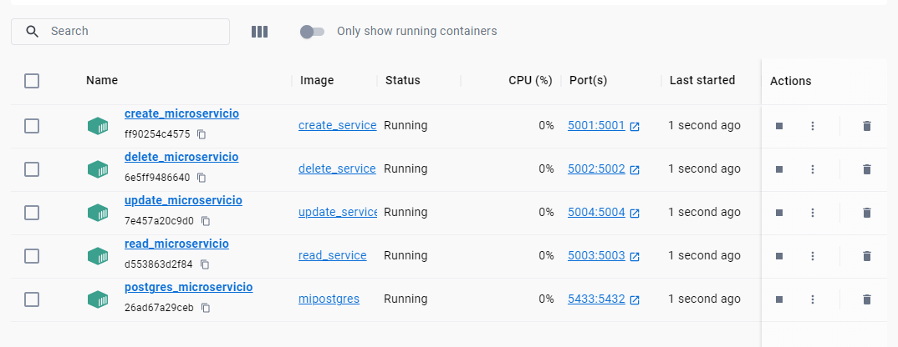
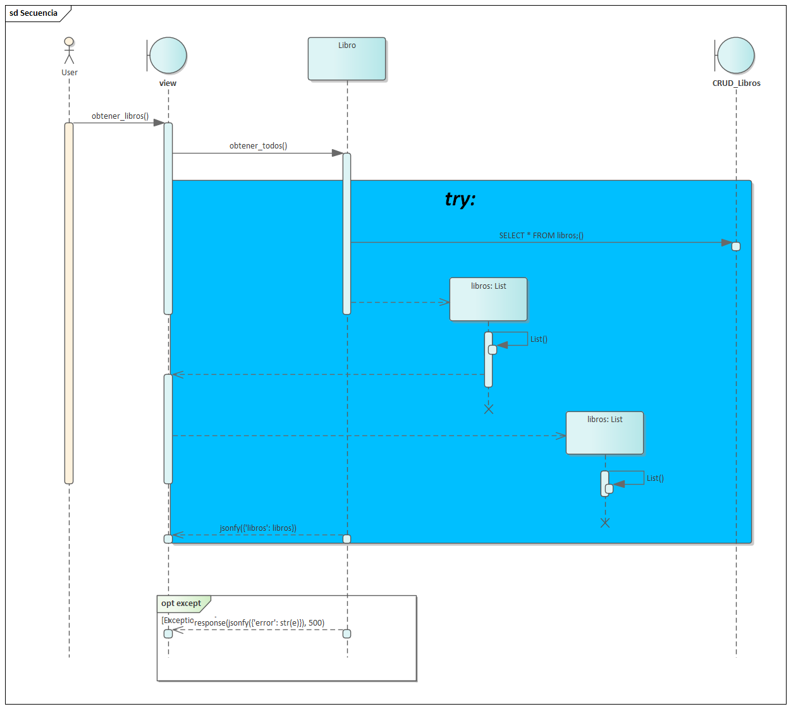

# Proyecto Final - Informatica

## Microservicios CRUD librería

### Autores:

- Laura Tatiana Ramírez Rodríguez - 20182020098
- Cristopher Vargas Ruda - 20172007008
- Cristian Camilo Méndez Trujillo - 20191020139

### Descripción:

Este proyecto consiste en la implementación de microservicios para realizar operaciones CRUD (Crear, Leer, Actualizar, Eliminar) en una librería. Cada microservicio se encarga de gestionar las operaciones relacionadas con la información de los libros, proporcionando una interfaz para agregar, consultar, actualizar y eliminar registros de la base de datos.

Los microservicios se han desarrollado utilizando Flask, SQLAlchemy y PostgreSQL como sistema de gestión de base de datos. Cada autor ha contribuido al diseño y desarrollo de diferentes aspectos de los microservicios para lograr una implementación robusta y eficiente.

### Arquitectura del Proyecto
En este proyecto, la arquitectura está compuesta por diversos componentes que trabajan en conjunto para facilitar las operaciones CRUD (Crear, Leer, Actualizar, Eliminar) sobre una base de datos PostgreSQL. A continuación, se detallan los principales componentes y sus interacciones:

#### Componentes Principales:

##### Diagrama de Componentes:

##### Front-end:

El componente de front-end se encarga de la interfaz de usuario y la interacción directa con los usuarios.
Se comunica con los microservicios correspondientes para realizar las operaciones CRUD.

##### Microservicios:

- *create_microservicio (Puerto 5001)*: Encargado de crear nuevos registros en la base de datos.
- *delete_microservicio (Puerto 5002)*: Responsable de eliminar registros en la base de datos.
- *update_microservicio (Puerto 5004)*: Encargado de actualizar registros existentes en la base de datos.
- *read_microservicio (Puerto 5003)*: Realiza operaciones de lectura, incluyendo la obtención de todos los registros.
- *postgres_microservicio (Puerto 5432)*: Maneja la base de datos PostgreSQL y gestiona las operaciones de la base de datos.
- *Red Docker*:Todos los microservicios, excepto el front-end, se ejecutan en una red Docker llamada mired, que facilita la comunicación entre ellos.

##### Microservicios en Docker

#### Ejemplo de Diagrama de Secuencia - Obtener Todos los Libros:

A continuación, se presenta un ejemplo de cómo se realiza la operación de obtener todos los libros desde la interfaz de usuario hasta la base de datos:

##### Diagrama de secuencia:

- El usuario solicita ver todos los libros a través del front-end.
- El front-end se comunica con el microservicio read_microservicio.
- read_microservicio ejecuta su lógica y se comunica con postgres_microservicio para obtener todos los libros de la base de datos.
- postgres_microservicio realiza la consulta en la base de datos y devuelve los resultados a read_microservicio.
- read_microservicio envía la lista de libros al front-end.
- El front-end presenta la lista de libros al usuario.

Este flujo garantiza una separación clara de responsabilidades y la escalabilidad del sistema mediante el uso de microservicios y contenedores Docker.